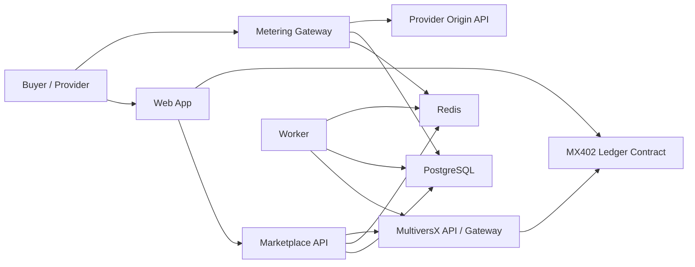

# MX402 Exchange Engineering Architecture

## Goal
Ship a technically practical MVP for a MultiversX-native pay-per-API marketplace.

Implementation spec:
- `docs/MX402_V1_SPEC.md`

The MVP is built around:
- one supported payment asset
- prepaid balances
- off-chain request metering
- batched on-chain settlement
- curated provider onboarding

This is not a trustless per-request settlement system. It is a fast, buildable system that uses MultiversX for value custody and settlement while keeping API traffic off-chain.

## Design Principles
- Keep the runtime simple: modular monorepo, few services, clear ownership
- Put money movements on-chain, but keep request authorization and metering off-chain
- Optimize for low latency on API calls
- Make provider integration thin
- Preserve an upgrade path toward more open and verifiable settlement later

## Recommended Monorepo Structure
```text
mx402-exchange/
  apps/
    web/                     # Next.js marketplace + dashboards
    api/                     # Public REST API + admin API + auth
    gateway/                 # Metered request proxy and auth layer
    worker/                  # Settlement, chain sync, payouts, reconciliation
  contracts/
    mx402-ledger/            # MultiversX Rust smart contract
  packages/
    db/                      # Prisma schema, migrations, generated client
    domain/                  # Shared domain models and Zod validation
    multiversx/              # Chain client helpers, tx builders, event parsers
    gateway-sdk/             # Consumer SDK for calling paid APIs
    provider-sdk/            # Provider middleware / header validation helpers
    config/                  # Shared env parsing and runtime config
    observability/           # Logging, tracing, metrics helpers
  docs/
    MX402_EXCHANGE.md
    MX402_ARCHITECTURE.md
```

## Runtime Components
### 1. `apps/web`
Purpose:
- public API marketplace
- provider onboarding
- buyer onboarding
- deposit and withdrawal flows
- usage, receipts, balances, and payout dashboards

Technology:
- Next.js
- `@multiversx/sdk-dapp` for wallet connection, transaction signing, and transaction tracking
- Native Auth enabled for wallet-backed sessions

Main screens:
- marketplace home
- API product details
- provider dashboard
- buyer dashboard
- project/API key management
- wallet funding
- usage and receipt history
- provider earnings and payout history

### 2. `apps/api`
Purpose:
- system-of-record API for marketplace data
- wallet-backed authentication
- provider management
- product catalog
- project and API key management
- buyer ledger mirror
- admin approvals
- reporting endpoints for web UI

Technology:
- Node.js + TypeScript
- Fastify
- `sdk-js` / `sdk-core` for chain operations
- Native Auth server validation for backend sessions
- PostgreSQL for primary relational storage
- Redis for hot balance cache, rate-limit state, locks, and idempotency
- Prisma for schema management and typed DB access

Internal modules:
- `auth`
- `users`
- `providers`
- `products`
- `projects`
- `apiKeys`
- `balances`
- `receipts`
- `settlement`
- `admin`

### 3. `apps/gateway`
Purpose:
- receive paid API traffic
- authenticate the buyer project/API key
- check spendable balance
- create a temporary usage reservation
- forward the request to the provider origin
- meter outcome
- finalize or release the reservation

Why a separate service:
- this path has different performance and security needs from the main API
- it needs tighter timeouts, request streaming, and rate limiting
- it should scale independently from dashboard traffic

Responsibilities:
- request auth
- rate limiting
- per-product pricing lookup
- reservation lock against buyer balance
- request forwarding
- usage event write
- HTTP `402 Payment Required` on insufficient balance

### 4. `apps/worker`
Purpose:
- index contract deposits and withdrawals
- reconcile on-chain and off-chain balances
- assemble settlement batches
- submit settlement transactions
- monitor failures and retry safely
- prepare provider payout jobs

Jobs:
- `sync-chain-events`
- `rebuild-balance-cache`
- `close-usage-window`
- `create-settlement-batch`
- `submit-settlement-batch`
- `mark-payouts-claimable`
- `reconcile-ledger`

### 5. `contracts/mx402-ledger`
Purpose:
- custody prepaid buyer funds
- store buyer on-chain balances
- store provider claimable balances
- store platform fee vault balance
- apply settlement batches
- allow withdrawals and provider claims

Technology:
- MultiversX Rust smart contract framework
- tested with Chain Simulator and Rust interactors

## Architecture Diagram


## Contract Boundary
The contract should stay narrow. It is not the API marketplace itself. It is the ledger and settlement layer.

### Contract Responsibilities
- accept deposits in one supported asset
- track buyer available on-chain balance
- register provider payout address
- apply settlement batches that:
  - debit buyer balances
  - credit provider claimable balances
  - credit platform fee vault
- allow buyers to withdraw unused funds
- allow providers to claim accrued earnings
- expose events for deposits, withdrawals, batch settlements, and claims
- support pause and privileged admin controls

### Contract Should Not Do
- meter individual API requests
- store API metadata or provider catalogs
- manage API keys
- enforce off-chain rate limits
- decide request-level billing outcomes

### Proposed Contract State
- `supported_token_id`
- `paused`
- `fee_bps`
- `operator_address`
- `treasury_address`
- `buyers[address] => balance`
- `providers[provider_id] => payout_address`
- `provider_claimable[provider_id] => balance`
- `processed_batch_ids[batch_id] => bool`
- `fee_vault_balance`

### Proposed Endpoints
- `deposit()`
- `withdraw(amount)`
- `register_provider(provider_id, payout_address)`
- `update_provider_payout(provider_id, payout_address)`
- `apply_settlement_batch(batch_id, buyer_debits[], provider_credits[], fee_amount)`
- `claim_provider_earnings(provider_id, amount?)`
- `set_fee_bps(...)`
- `set_operator(...)`
- `pause()`
- `unpause()`

### Roles
- `buyer`: deposits and withdraws funds
- `provider`: claims earnings and manages payout address
- `operator`: submits validated settlement batches
- `admin / multisig`: emergency and config controls

## Off-Chain Data Boundary
The off-chain system is the operational truth for request activity and the contract is the monetary truth for funds custody and final settlement.

### Core Tables
- `users`
- `wallet_sessions`
- `providers`
- `provider_products`
- `provider_routes`
- `buyer_projects`
- `project_api_keys`
- `ledger_accounts`
- `ledger_entries`
- `usage_reservations`
- `usage_events`
- `usage_receipts`
- `chain_transactions`
- `settlement_batches`
- `settlement_lines`
- `provider_claims`

### Important Invariants
- off-chain spendable balance must never exceed on-chain buyer balance minus unsettled usage
- every metered charge must map to one usage receipt
- every settlement line must be idempotent
- every on-chain batch submission must have a stable `batch_id`
- provider earnings shown in UI must distinguish:
  - unsettled earnings
  - on-chain claimable earnings
  - claimed payouts

## Authentication Model
### User Authentication
- wallet login from `sdk-dapp`
- Native Auth token generated client-side
- backend validates Native Auth token and issues session

### Project Authentication
- buyer creates a `project`
- project receives an API key or signed access credential
- gateway authenticates project credential on every request
- gateway maps the project to:
  - buyer wallet
  - allowed products
  - rate limits
  - spend rules

### Provider Authentication
- provider wallet login for dashboard actions
- provider origin-to-gateway shared secret or signed header for upstream validation in pilot mode

## Billing Model
For MVP, use fixed `price_per_call`.

Billing policy:
- charge only on provider success response by default
- release reservation on hard failure or timeout
- support provider-specific override later if some APIs should charge on attempt

This keeps billing deterministic and easier to reason about in the pilot.

## First End-to-End User Flow
This is the first critical flow the MVP must support: provider lists an API, buyer funds balance, buyer makes the first paid call, and provider becomes claimable for payout.

### Phase 1: Provider Onboarding
1. Provider opens the web app and connects a MultiversX wallet.
2. Web app authenticates using Native Auth and opens the provider dashboard.
3. Provider creates a product:
   - product name
   - base URL
   - endpoint path template
   - fixed price per call
   - payout wallet address
4. API stores the product in `pending` state.
5. Admin reviews the provider and approves the product.
6. API generates gateway routing config for that provider product.

### Phase 2: Buyer Funding
1. Buyer connects wallet in the web app.
2. Buyer authenticates with Native Auth.
3. Buyer creates a `project` that will consume paid APIs.
4. Buyer selects a product and clicks `Fund balance`.
5. Web app builds and signs a deposit transaction with `sdk-dapp`.
6. Buyer sends the deposit transaction to the `mx402-ledger` contract.
7. Worker indexes the deposit event from MultiversX API / Gateway.
8. API updates the buyer ledger mirror and Redis balance cache.
9. Buyer can now generate a project API key.

### Phase 3: First Paid API Call
1. Buyer app sends a request to the MX402 gateway:
   - project API key
   - target product
   - request payload
2. Gateway validates the API key.
3. Gateway checks the buyer cached spendable balance.
4. Gateway creates a reservation equal to `price_per_call`.
5. Gateway forwards the request to the provider origin.
6. Provider returns a successful response.
7. Gateway finalizes the reservation into a usage event and usage receipt.
8. Gateway returns the provider response to the buyer.
9. Buyer dashboard now shows:
   - one paid call
   - one receipt
   - reduced available balance
10. Provider dashboard now shows:
   - one new usage event
   - increased unsettled earnings

### Phase 4: Settlement and Payout
1. Worker closes the settlement window.
2. Worker aggregates finalized usage by buyer and provider.
3. Worker creates a deterministic `batch_id`.
4. Worker submits `apply_settlement_batch(...)` to the contract.
5. Contract debits buyer on-chain balances and credits provider claimable balances plus platform fee vault.
6. Worker marks the batch as finalized after on-chain confirmation.
7. Provider can claim earnings from the contract, or the system can enable guided self-claim from the dashboard.

## Failure Handling
### Insufficient Balance
- gateway rejects the request before forwarding
- response is HTTP `402 Payment Required`
- response payload includes:
  - product id
  - required amount
  - current spendable balance
  - top-up action URL

### Provider Timeout or Error
- reservation is released
- no usage receipt is finalized
- error is logged with provider route metadata

### Settlement Submission Failure
- batch remains `prepared`, not `finalized`
- retry is idempotent using the same `batch_id`
- no UI balance changes are treated as on-chain final until confirmation

## MVP Infrastructure
- PostgreSQL for marketplace and ledger mirror state
- Redis for request-path balance checks, reservations, and rate limiting
- BullMQ for background job scheduling and retries
- object storage for provider specs and optional receipt exports
- one container each for `web`, `api`, `gateway`, `worker`
- contract deployed to devnet first, then mainnet only after pilot validation

## Testing Strategy
### Contract
- endpoint unit tests
- settlement idempotency tests
- claim and withdraw tests
- pause and role tests

### API and Gateway
- auth and session tests
- balance cache consistency tests
- reservation concurrency tests
- buyer request happy path
- insufficient balance path
- provider failure path

### End-to-End
- deposit -> index -> paid call -> settlement -> claim
- run against Chain Simulator for repeatable contract flow tests
- run smoke tests against devnet before pilot launch

## Why This Architecture Fits MultiversX
- `sdk-dapp` covers wallet login, signing, and transaction tracking for the web app
- Native Auth fits wallet-backed backend sessions
- `sdk-js` / `sdk-core` fits transaction and contract interaction from backend services
- MultiversX API and Gateway provide indexed reads plus lower-level transaction handling
- the Rust framework plus Chain Simulator support realistic contract development and testing

Official references:
- https://docs.multiversx.com/sdk-and-tools/sdk-dapp/
- https://docs.multiversx.com/sdk-and-tools/sdk-js/
- https://docs.multiversx.com/sdk-and-tools/rest-api/
- https://docs.multiversx.com/sdk-and-tools/rest-api/multiversx-api/
- https://docs.multiversx.com/sdk-and-tools/rest-api/transactions/
- https://docs.multiversx.com/sdk-and-tools/chain-simulator/
- https://docs.multiversx.com/developers/smart-contracts/
- https://docs.multiversx.com/developers/meta/interactor/interactors-overview/
- https://multiversx.com/builders/builder-tools-resources

## Build Order
1. Contract interface and data model
2. Buyer deposit and balance sync
3. Provider product registration
4. Gateway auth and fixed-price metering
5. Buyer paid-call flow
6. Settlement batch pipeline
7. Provider claim flow
8. Dashboard reporting and admin tooling
